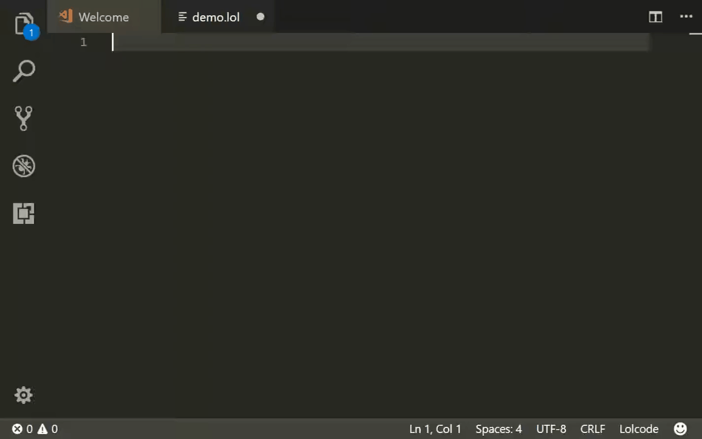

## LOLCODE Support for Visual Studio Code 

An extension for VS Code which provides support for the LOLCODE esoteric language.

## Features
- Syntax Highlighting
## How to use this extension?

Install and open Visual Studio Code. Press Ctrl+Shift+X or Cmd+Shift+X to open the Extensions pane. Find and install the LOLCODE extension. You can also install the extension from the Marketplace. 

Open any .lol or .lols  file in VS Code. The extension is now activated.
## Release Notes
### 1.0.0
- Initial Release

**Enjoy!**